<div align="center">

# Industrial-data

**스마트 안전장비는 정말 산업재해를 줄이는가** — K-NAVI의 출발점이 된 산업재해 데이터 분석과 통계 검증


[K-NAVI 조직](https://github.com/SAX-AI-TeamProject1) · [▶ K-NAVI 데모 영상](https://youtu.be/uNY5pw-5RxQ) · [분석 문서](./docu/비율검정_분석문서.md) · [발표 자료](./report/스마트안전장비_도입효과_분석.pptx)

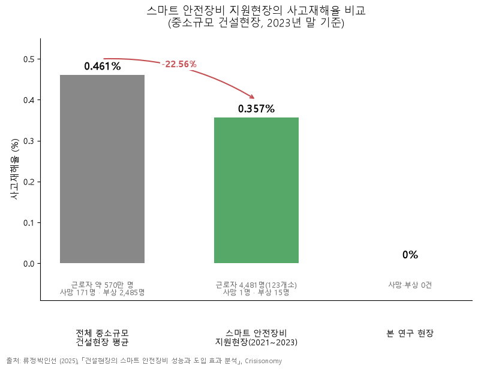

</div>

<br/>

로봇과 스마트 장비가 늘면 현장이 안전해진다는 말은 자주 나옵니다. 이 저장소는 그 말을 **공개 통계로 직접 확인**한 기록입니다.

> **결론.** 스마트 안전장비 지원현장의 재해율은 전국 평균보다 **22.56% 낮았지만**(0.357% vs 0.461%),
> **통계적으로 유의하지 않았습니다**(Fisher p = 0.182, 95% CI가 0 포함).
> 사고가 드문 사건이라 현재 표본(4,481명)의 검정력은 **24%** 에 불과하고, 같은 차이를 확인하려면 **약 25,200명**이 필요합니다.
> 효과를 "증명했다"고 쓰지 않고, 이 공백을 정밀 인지 기술(K-NAVI)의 필요성으로 연결했습니다.

## 분석 흐름

처음 계획은 도입 전/후를 짝지은 **대응표본 t-검정**이었습니다. 쌍을 만들 데이터를 끝내 확보하지 못했고,
재해율이 평균이 아니라 **비율 데이터**라는 점을 다시 보고 방법을 바꿨습니다.

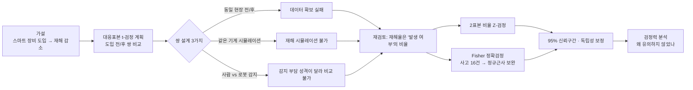

| 왜 t-검정이 아닌가 | |
|---|---|
| 데이터의 성격 | 재해율 = 재해자 수 ÷ 근로자 수. 연속형 측정값의 평균이 아니라 **사건 발생 비율** |
| 쌍(pair) 설계 | 동일 현장 전/후, 같은 기계, 사람 vs 로봇 — 세 가지 모두 데이터 확보 실패로 기각 ([기록](./docu/work.md)) |
| 채택 | 두 집단의 비율 차이를 보는 **2표본 비율검정** + 작은 사건 수를 위한 **Fisher 정확검정** |

## 1. 배경 — 로봇은 늘었는데 재해는 줄지 않았다

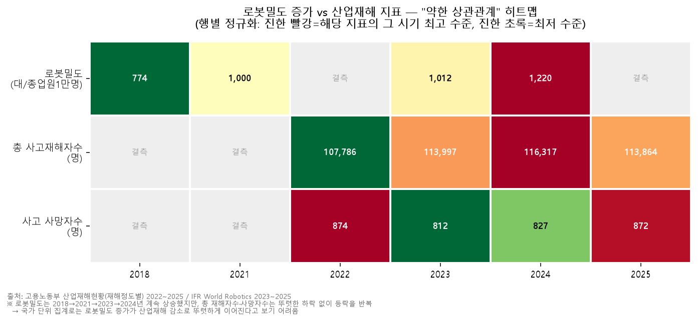

로봇밀도는 2018년 774대에서 2024년 1,220대(종업원 1만 명당)로 늘었지만, 사고재해자 수는 10만 명대에서 등락만 반복했습니다.
국가 단위 집계에서는 **로봇 도입이 재해 감소로 뚜렷하게 이어지지 않습니다.** 그래서 범위를 좁혀, 스마트 안전장비를 실제로 도입한 현장의 재해율을 비교했습니다.

<details>
<summary>탐색 차트 더 보기 (업종별 발생 형태 · 재해 정도 · 치료 기간)</summary>
<br/>

| | |
|---|---|
| 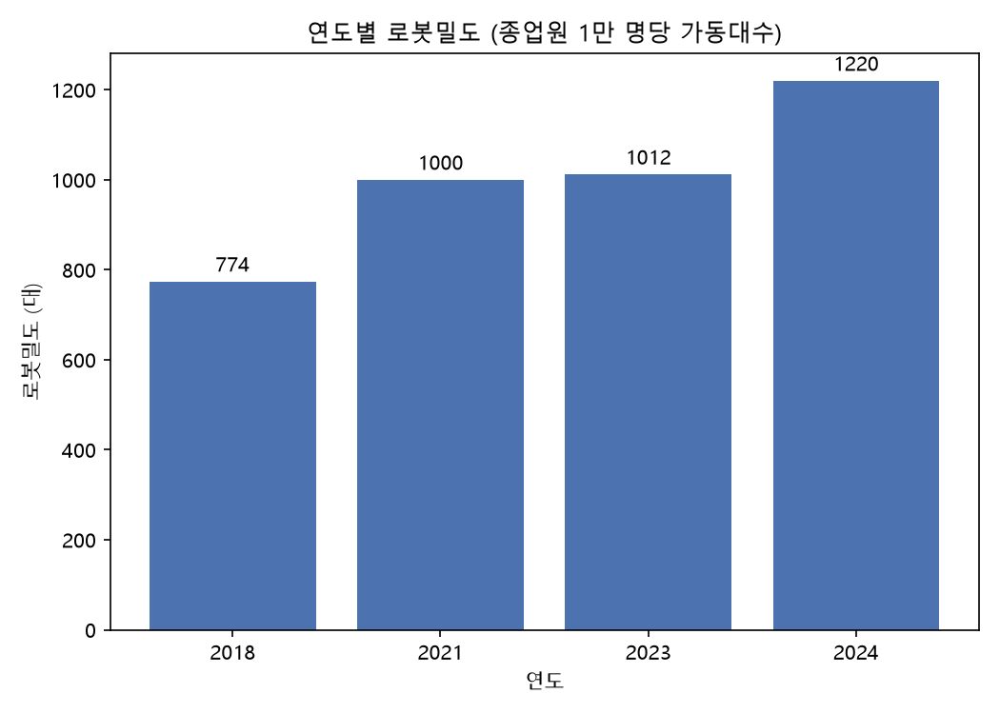 | 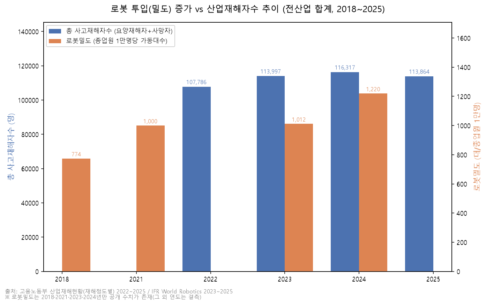 |
| 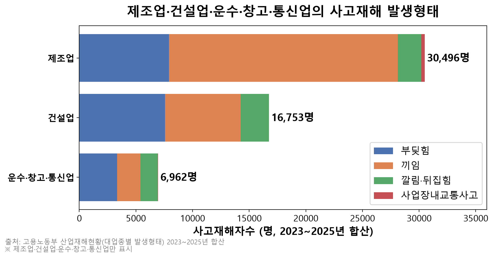 | 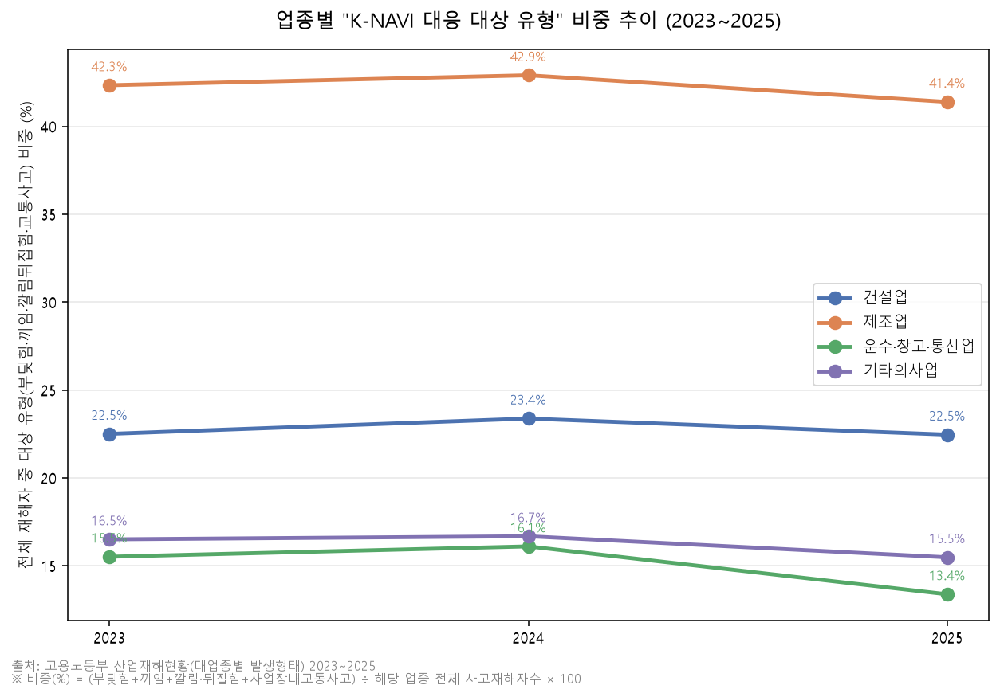 |
| 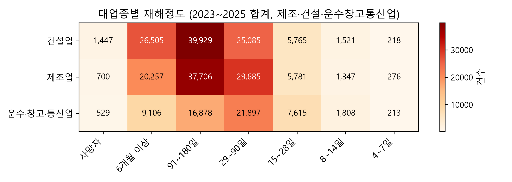 | 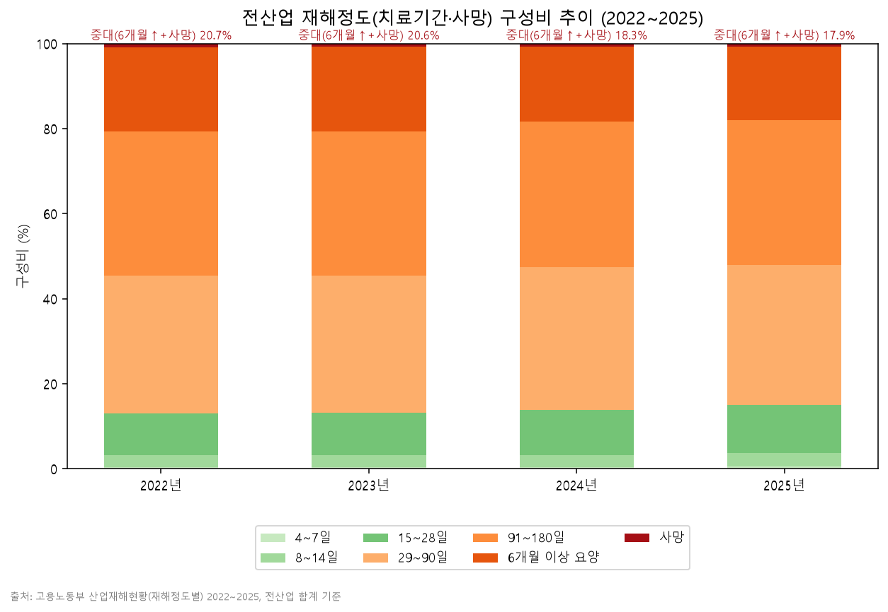 |

</details>

## 2. 검정 — 22.56% 차이는 우연일 수 있는가

| | 근로자 수 (n) | 사고자 수 (x) | 재해율 |
|---|---:|---:|---:|
| 전국 중소규모 건설현장 (2023년 말) | 576,224 | 2,656 | 0.461% |
| 스마트 안전장비 지원현장 123개소 (2021~2023) | 4,481 | 16 | 0.357% |

**H0** 두 재해율이 같다 · **H1** 도입현장 재해율이 더 낮다 (단측, α = 0.05)

| 2표본 비율 Z-검정 | Fisher 정확검정 |
|---|---|
| 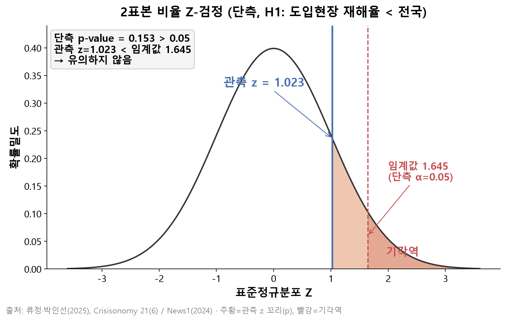 | 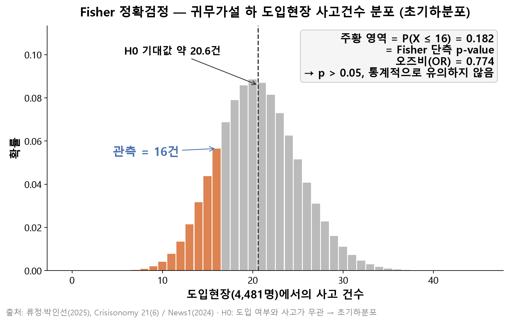 |
| 관측 z = 1.023 < 임계값 1.645 | 관측 16건 > 기각 임계 12건 |

- **Z-검정:** 정규분포 위에서 관측값이 기각역(z > 1.645)에 들어가지 않습니다.
- **Fisher 정확검정:** 도입현장 사고가 16건뿐이라 정규근사 오차가 생길 수 있어, 초기하분포로 정확한 확률을 다시 계산했습니다. 귀무가설이 맞다면 기대 사고 건수는 약 20.6건이고, 16건 이하가 나올 확률이 18.2%입니다.

## 3. 신뢰구간과 검정력 — 왜 유의하지 않았나

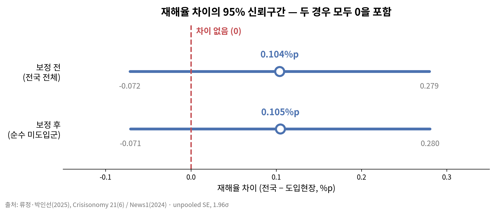

차이의 95% 신뢰구간은 **[-0.072%p, 0.279%p]** 로 0을 포함합니다. 지원현장이 전국 통계에 이미 포함돼 있을 가능성(독립성 위반)도 점검해,
전국에서 지원현장을 뺀 **순수 미도입군**으로 다시 계산했지만 결과는 거의 같았습니다(지원현장 비중 0.78%).

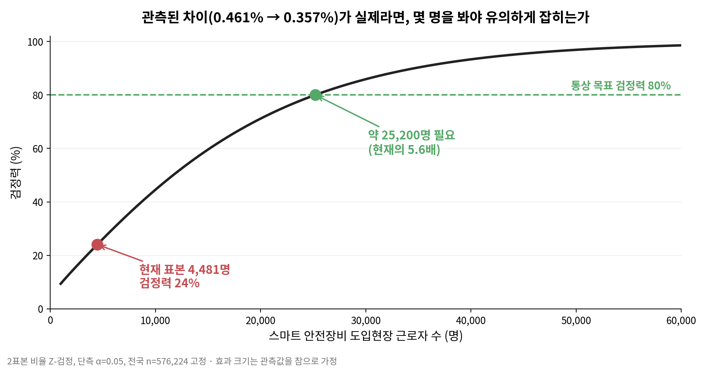

"유의하지 않다"가 "효과가 없다"는 뜻은 아닙니다. 관측된 차이가 실제라고 가정해도, **현재 표본으로 그 차이를 잡아낼 확률(검정력)은 24%** 입니다.
통상 기준인 80%에 도달하려면 지원현장 근로자가 **약 25,200명(현재의 5.6배)** 필요합니다. 사고는 드문 사건이라, 효과를 입증하려면 그만큼 데이터가 쌓여야 합니다.

## 결과 요약

| 검정 | 보정 전 | 보정 후 (순수 미도입군) | 판정 (α = 0.05) |
|---|---|---|---|
| 2표본 비율 Z-검정 (단측) | z = 1.023, p = 0.153 | z = 1.031, p = 0.151 | 유의하지 않음 |
| Fisher 정확검정 (단측) | OR = 0.774, p = 0.182 | OR = 0.772, p = 0.180 | 유의하지 않음 |
| 차이의 95% 신뢰구간 | [-0.072%p, 0.279%p] | [-0.071%p, 0.280%p] | 0 포함 |
| 검정력 (관측 효과 기준) | 24% | — | 80%까지 약 25,200명 필요 |

## 한계

- **선택 편향:** 지원현장 123개소는 무작위 표본이 아니라 지원사업 선정 현장입니다. 원래 관리 수준이 높았을 수 있습니다.
- **교란변수 미통제:** 재해율 차이가 장비 때문인지, 현장 규모·관리 수준 때문인지 이 검정만으로는 구분할 수 없습니다.
- **원자료 정정:** 논문 본문의 "약 570만 명"은 재해율 0.461%와 맞지 않아, 인용 기사 원자료의 **576,224명**을 사용했습니다.

## 재현

```bash
pip install -r requirements.txt
python src/origin/proportion_test.py           # 검정 결과표 (Z · Fisher · 신뢰구간 · 독립성 보정)
python src/plane/visualize_proportion_test.py  # Z-검정 · Fisher 분포 그림
python src/plane/visualize_power_ci.py         # 신뢰구간 · 검정력 곡선
Rscript visualizations/proportion_test_R/proportion_test_viz.R   # 같은 그림을 R로
```

VS Code에서는 `Tasks: Run Task` → `3. 비율검정 검증 재현` 으로 가상환경 생성부터 검증까지 한 번에 실행됩니다.

## 구조

```
asset/           고용노동부 산업재해현황(2022~2025) · IFR 로봇밀도 CSV
src/origin/      proportion_test.py — 검정 모듈 (분석 문서 수치와 일치 확인)
src/plane/       탐색 차트 · 검정 시각화 스크립트
src/report/      build_pptx.py — 발표 자료 생성
visualizations/  차트 01~13, proportion_test_R/ (Z · Fisher 그림 + R 스크립트)
docu/            비율검정_분석문서.md · design.md · work.md(작업 · 데이터 수집 시도 기록)
report/          스마트안전장비_도입효과_분석.pptx
```

## 출처

- 류정 · 박인선 (2025), 「건설현장의 스마트 안전장비 성능과 도입 효과 분석」, *Crisisonomy* 21(6)
- News1 (2024), 중소규모 건설현장 재해 통계 보도
- 고용노동부, 산업재해현황 (2022~2025)
- IFR, *World Robotics* (2023~2025)

<div align="center">
<br/>

이 분석은 [K-NAVI](https://github.com/SAX-AI-TeamProject1) — 수신호 인식과 장애물 감지로 물류 로봇을 멈추는 시뮬레이션 — 의 기획 근거입니다.

**[▶ K-NAVI 데모 영상](https://youtu.be/uNY5pw-5RxQ)**

</div>
